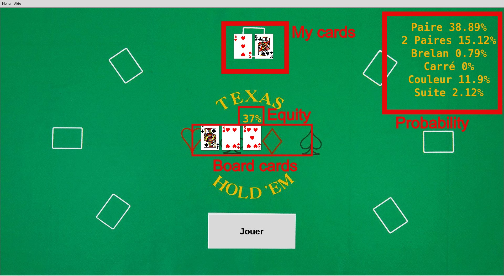
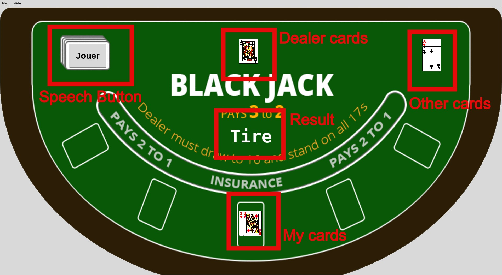

# All-in (Poker / BlackJack helper)

The goal of the project is to help poker and blackjack players giving them more information about their probabilities.

## Goals

- Speech recognition (in french)
- Need to have a graphical interface
- Need to provide as many statistics as possible
- Poker and blakjack support
- The result need to be clear for the user even if the algorithm is complex

## Requirements

* Python 3.7+

* pygame >=1.9.6
* SpeechRecognition >=3.8.1

How to install all the requirements :
```bash
sudo pip3 install -r requirements.txt
```

## Usage

```bash
./All-In.py
```

### Poker

#### Speech recognition

Text to say | Action |
------------ | ------------- |
"J'ai" or "Preflop" + (card) + (card) | I have (card) |
"Flop" + (card) + (card) + (card) | Gives the 3 first cards |
"Turn" + (card) | Give the 4th card |
"River" + (card) | Give the last card |
"Recommence" + (card) | Restart a round |
"Remise à zéro" + (card) | Restart all (card mix) |
Example of card | "Trois de carreau" or "Trois" |

Exemple of one round (stopped at the turn) :

"J'ai trois de coeur et roi de trefle"

"flop valet de pique et quatre de coeur et cinq de coeur"



Traduction :

French | English |
------------ | ------------- |
Paire | Pair |
Deux Paires | Two pair |
Brelan | Three of a kind |
Carré | Four of a kind |
Couleur | Flush |
Suite | Straight |

### BlackJack

#### Speech recognition

Text to say | Action |
------------ | ------------- |
"J'ai" or "Moi" + (card) | I have (card) |
"Autre" + (card) | Other player has (card) |
"Croupier" + (card) | The dealer has (card) |
"Recommence" + (card) | Restart a round |
"Remise à zéro" + (card) | Restart all (card mix) |
Example of card | "Trois de carreau" or "Trois" |

###### No need to specify the color of the card

Exemple of one round :

"J'ai un trois de coeur"

"Autre as"

"J'ai une dame"

"Autre deux"

"Croupier valet"



Traduction :

French | English |
------------ | ------------- |
... | waiting |
Stop | Stop |
Split | Split |
Tire | Draw |
Double | Double |

## Tests

    .
    ├ log.html               # Logs there
    ├ report.html            # Tests result here
    └ README.md

## Authors

* **Luis Rosario** - *Member 1* - [Luisrosario](https://github.com/Luisrosario2604)
* **Matthieu Daugas** - *Member 2* - [MatthieuDaugas](https://github.com/MatthieuDaugas)
